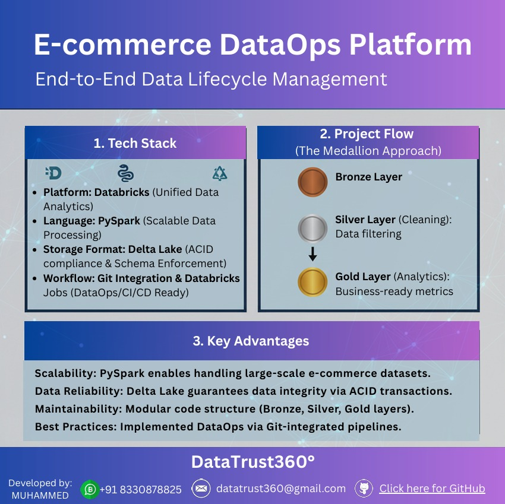

#  E-commerce DataOps Pipeline: Medallion Architecture

This project demonstrates an end-to-end data pipeline built using **Databricks**, **PySpark**, and **Delta Lake**. It follows the **Medallion Lakehouse** architecture, focusing on robust data ingestion, cleaning, and business intelligence, all while strictly adhering to **DataOps** best practices.

---

###  Project Highlights

---

* **Medallion Lakehouse:** Seamless data progression through **Bronze (Raw)**, **Silver (Cleaned)**, and **Gold (Aggregated)** layers.
* **Schema Enforcement:** Implementation of rigid schema management via `StructType` to ensure data quality from the point of ingestion.
* **Automated Data Quality:** Built-in logic to handle deduplication, null-value handling, and price/quantity validation.
* **Scalable Analytics:** Generation of business insights (e.g., status-wise revenue analysis) using distributed computing.

---

###  Technical Stack & Tools

| Category | Technology |
| --- | --- |
| **Data Platform** | Databricks Unified Analytics |
| **Language** | PySpark |
| **Storage** | Delta Lake (ACID Compliant) |
| **Version Control** | Git / GitHub |
| **Workflow** | Databricks Workflows / Jobs |

---

###  Architecture Design Details

* **Bronze Layer (Ingestion):** The `ingest_bronze` function loads raw e-commerce data. We utilize `overwriteSchema` to maintain flexibility, allowing the pipeline to evolve alongside changing data requirements.
* **Silver Layer (Cleaning):** This layer acts as the filter:
* **Deduplication:** Uses `dropDuplicates(["order_id"])` to maintain record uniqueness.
* **Casting/Standardization:** Converts raw timestamps to `TimestampType` and standardizes the `status` column to lowercase.
* **Validation:** Filters out invalid entries where `price` or `quantity` is $\le 0$.


* **Gold Layer (Reporting):** The final stage where we compute `Total Revenue` using the logic:

$$Total Revenue = Price \times Quantity$$


---

###  Repository Structure

```text
Ecommerce-DataOps-Project/
├── notebooks/
│   └── main_pipeline.py     # Central execution script
├── src/
│   ├── bronze_ingestion.py  # Ingestion logic & Schema definition
│   ├── silver_cleaning.py   # Data validation & transformation
│   └── gold_analytics.py    # Business metrics computation
└── README.md                # Project documentation

```

---

###  How to Run the Pipeline

1. **Clone:** Import this repository into your Databricks Workspace via Repos.
2. **Setup:** Ensure the `src` directory is added to your system path (handled automatically by the pipeline's path-management logic).
3. **Execution:** Run the `main_pipeline.py` notebook. This triggers the entire workflow from ingestion to report generation.
4. **Verification:** Query the created Delta tables in the Catalog:
* `fmcg.default.ecommerce_bronze`
* `silver_orders`
* `gold_order_metrics`


---

###  Why This Project Matters (Advantages)

* **Data Integrity:** Leveraging Delta Lake ensures **ACID compliance**, preventing data corruption even during concurrent writes.
* **Maintainability:** The **Modular Design** (separate files for each layer) makes unit testing and debugging significantly easier.
* **DataOps Maturity:** By integrating Git, the codebase is version-controlled, reproducible, and ready for CI/CD implementation.

---

###  Future Enhancements

* Implementing **Great Expectations** for automated data quality assertions.
* Scheduling the pipeline using **Databricks Workflows (Jobs)**.
* Adding unit tests using `pytest` to validate transformations.

